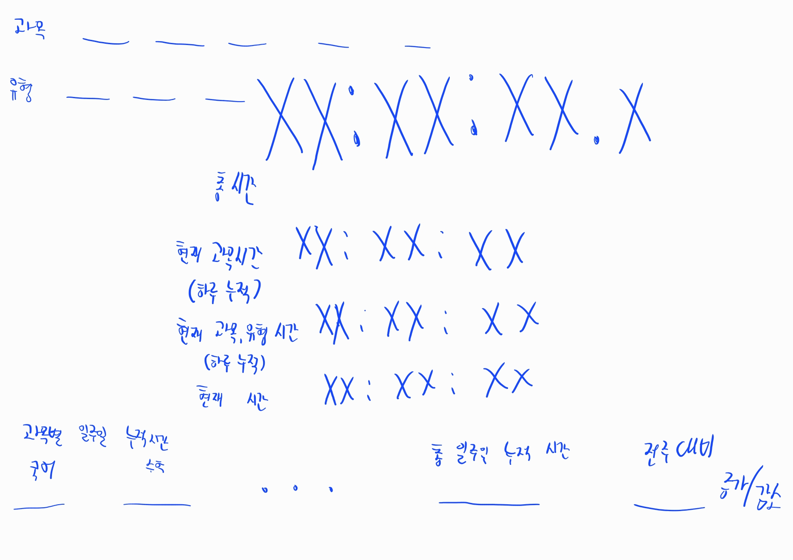
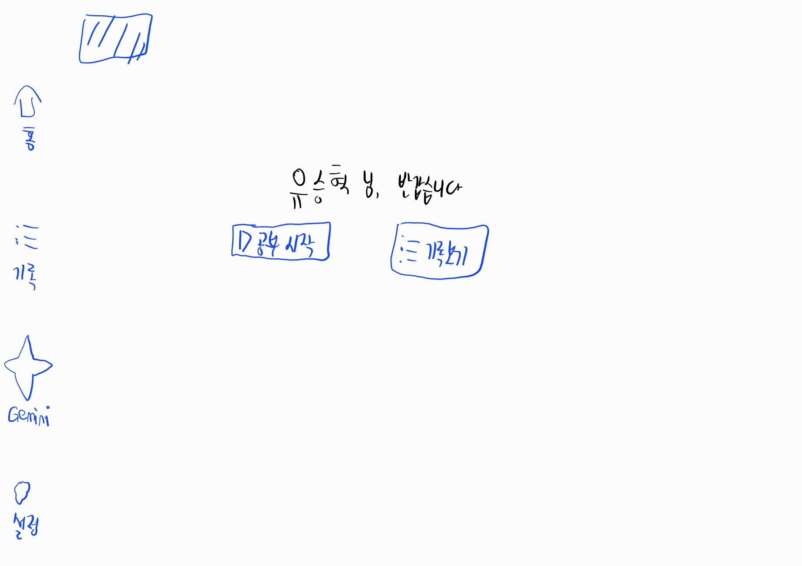
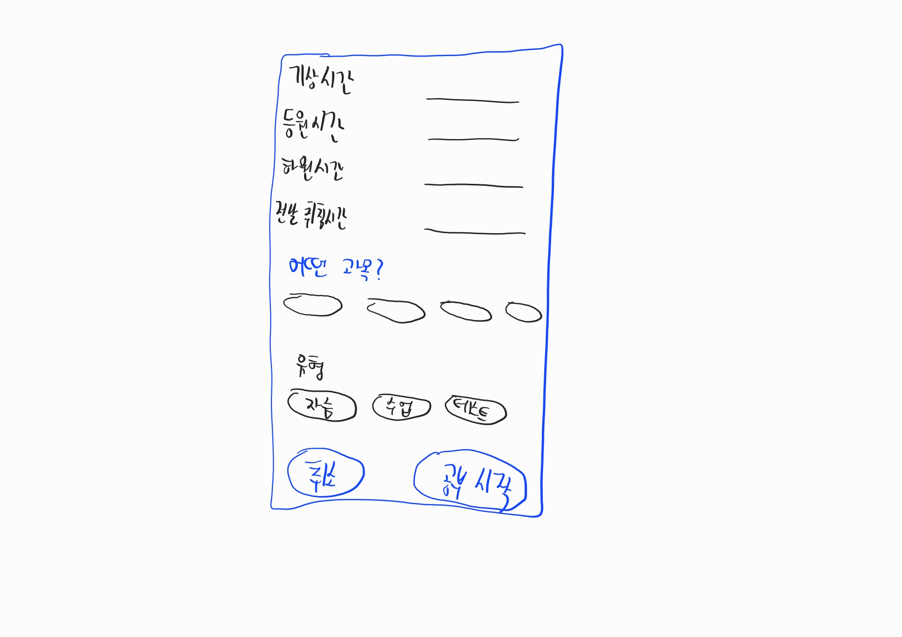

# StudyMeter

> 공부 시간을 정확하게 측정하고, 집중도를 실시간으로 모니터링하는 Android 학습 관리 앱

<p align="center">
  
  &nbsp;&nbsp;
  
  &nbsp;&nbsp;
  
</p>

---

## 주요 기능

### 타이머 & 세션 관리
- **절대 시각 기반 타이머** — 앱 종료·재시작 후에도 시간 정확도 유지
- 과목 / 유형 / 세부 항목(챕터 등) 선택 후 즉시 측정 시작
- 일시정지 / 재개, 세션 종료 후 자기평가(별점) 기록
- **카운트다운 모드** — 시험·테스트 시간 측정

### Now Bar (Android 알림)
- 공부 중 상단 알림바에 경과 시간 실시간 표시
- 알림에서 바로 일시정지 / 재개 / 종료 가능

### 집중도 모니터 (AI)
- PC에 실행 중인 집중도 서버(WebSocket)와 연결
- **BPM, EAR(졸음 지표), 시선 이동률** 실시간 표시
- 0~100점 집중도 점수 및 예상 잔여 집중 가능 시간 표시

### 통계 & 기록
- 일 / 주 / 월 단위 학습 기록 분석
- 과목별 막대 그래프 · 파이 차트 · 캘린더 히트맵
- 이전 기간 대비 증감 비교

### Gemini AI 학습 코치
- Gemini API 연동 AI 채팅
- 오늘/이번 주 학습 데이터를 AI에 공유해 피드백 요청 가능

### 기타
- 라이트 / 다크 / 시스템 테마
- 오프라인 완전 동작 (IndexedDB / Dexie)
- PWA + Android 네이티브 (Capacitor 8)

---

## 기술 스택

| 분류 | 기술 |
|------|------|
| Framework | React 19 + TypeScript |
| Build | Vite 7 |
| Styling | Tailwind CSS 4 |
| Animation | Framer Motion |
| DB | Dexie (IndexedDB) |
| Native | Capacitor 8 |
| AI | Google Gemini API |
| Charts | Recharts |

---

## GitHub Actions — APK 자동 빌드

`main` 브랜치에 push 하면 자동으로 debug APK가 빌드됩니다.

**Actions 탭** → 가장 최근 워크플로우 → **Artifacts** → `studymeter-debug-build-N` 다운로드

빌드 흐름:
```
npm ci → npm run build → npx cap sync android → ./gradlew assembleDebug
```

> APK는 30일간 보관됩니다.

---

## 로컬 개발 환경

### 요구사항
- Node.js 22+
- Android Studio (Android SDK API 36)
- Java 17

### 설치 & 실행

```bash
# 의존성 설치
npm install

# 웹 개발 서버 (브라우저)
npm run dev

# Android 빌드
npm run build
npx cap sync android
# Android Studio에서 android/ 폴더 열기
```

### 집중도 서버 연결 (선택)

PC에서 집중도 분석 서버를 실행한 뒤, 앱 **설정 → PC Focus 서버** 에 WebSocket 주소를 입력합니다.  
형식: `ws://192.168.x.x:8765/ws`

---

## 설정

앱 설정 화면에서 다음을 구성할 수 있습니다.

| 항목 | 설명 |
|------|------|
| 사용자 이름 | 홈 화면 인사말에 표시 |
| 과목 관리 | 과목 추가/삭제, 세부 항목(챕터 등) 설정 |
| 유형 관리 | 자습, 인강, 테스트 등 학습 유형 커스텀 |
| Gemini API 키 | AI 코치 기능 활성화 |
| 테마 | 라이트 / 다크 / 시스템 |
| PC Focus 서버 | 집중도 모니터 WebSocket 주소 |

---

## 프로젝트 구조

```
studymeter/
├── src/
│   ├── pages/          # Home, Study, Records, GeminiChat, Settings, EditRecords
│   ├── components/     # Layout, 모달, 카메라 등
│   └── lib/            # DB(Dexie), NativeBridge, focusSync
├── android/            # Capacitor Android 프로젝트
├── public/             # PWA 아이콘, manifest
└── .github/workflows/  # APK 자동 빌드 Action
```

---

## 라이선스

Private — All rights reserved.
